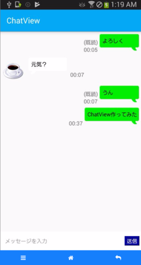

# ChatView

チャット画面用のCustomViewです。
サンプルではTalk APIを利用しています。
実際の利用に際しては、各自でTalk APIのAPIキーを取得する必要があります。




## 使用例


#### レイアウト

```activity_main.xml
<?xml version="1.0" encoding="utf-8"?>
<RelativeLayout xmlns:android="http://schemas.android.com/apk/res/android"
                android:layout_width="match_parent"
                android:layout_height="match_parent"
    >

    <com.hnimrod.chatview.ChatView
            android:id="@+id/layout_chatview"
            android:layout_width="match_parent"
            android:layout_height="match_parent"
            />
</RelativeLayout>
```

#### コード

```MainActivity.java
public class MainActivity extends AppCompatActivity {

    private ChatView chatView;
    
    @Override
    public void onCreate(Bundle savedInstanceState) {
        super.onCreate(savedInstanceState);
        setContentView(R.layout.activity_main);
        
        chatView = (ChatView) findViewById(R.id.layout_chatview);
        
        chatView.addRightMessage("こんにちは");
        chatView.addLeftMessage("こんばんは");
    }        
}
```


#### Talk API対応

Talk APIを使うためには、[Talk API](https://a3rt.recruit-tech.co.jp/product/talkAPI/) への登録が必要になります。

Talk APIページからのAPIキーの取得を行い、
取得したAPIキーを、`DialogueClient.java` の `API_KEY` に設定して、
ビルドし直してください。

```DialogueClient.java
public static final String API_KEY = ""; // Talk APIの API keyを設定してください
```